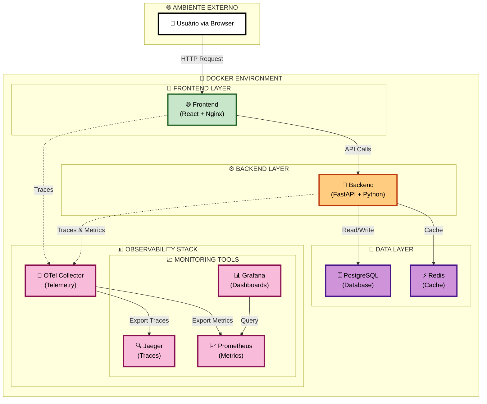

# 🧠 Fintelli - Finanças Inteligentes com IA

Esta é uma aplicação full-stack para gerenciamento de finanças pessoais com inteligência artificial, totalmente containerizada com Docker e instrumentada com **OpenTelemetry** para observabilidade completa.

## 🏗️ Diagrama de Arquitetura



## 📋 Arquitetura

- **Frontend**: Nginx servindo um site estático (HTML, CSS, JS) instrumentado com OTel JS SDK
- **Backend**: API RESTful com FastAPI (Python), instrumentada com OTel Python SDK
- **Banco de Dados**: PostgreSQL
- **Cache**: Redis
- **Orquestração**: Docker Compose

### 🔍 Pilha de Observabilidade

- **OTel Collector**: Recebe telemetria do frontend e backend
- **Jaeger**: Armazena e visualiza traces distribuídos
- **Prometheus**: Coleta e armazena métricas
- **Grafana**: Cria dashboards para visualizar as métricas

## 📁 Estrutura de Diretórios

```
fintelli/
├── backend/
│   ├── app/
│   │   ├── instrumentation.py  # Configuração do OpenTelemetry
│   │   └── main.py
│   ├── Dockerfile
│   └── requirements.txt
├── frontend/
│   ├── index.html
│   ├── telemetry.js            # Instrumentação OTel do Frontend
│   ├── Dockerfile
│   └── nginx.conf
├── charts/
│   └── fintelli/               # Helm Chart para Kubernetes
├── config/
│   ├── otel-collector-config.yml  # Configuração do Collector
│   └── prometheus.yml             # Configuração do Prometheus
├── .env
└── docker-compose.yml
```

## 🛠️ Pré-requisitos

- **Docker**
- **Docker Compose**

## 🚀 Como Configurar e Executar

### 1. Crie os arquivos e diretórios
Garanta que a estrutura de diretórios e todos os arquivos abaixo estejam criados.

### 2. Crie e configure o arquivo `.env`
Na raiz do projeto, crie o arquivo `.env` com suas credenciais e adicione a chave da API do Gemini:

```bash
# Credenciais do Banco de Dados Postgres
POSTGRES_DB=finance_db
POSTGRES_USER=finance_user
POSTGRES_PASSWORD=your_strong_password

# Chave da API do Gemini (Google AI) - OBRIGATÓRIO
GEMINI_API_KEY="SUA_CHAVE_API_AQUI"
```

### 3. Construa e inicie os contêineres
No terminal, na raiz do projeto, execute:

```bash
docker-compose up --build
```

### 4. Acesse os Serviços

| Serviço                   | URL                    | Descrição                       |
| ------------------------- | ---------------------- | ------------------------------- |
| **Aplicação de Finanças** | http://localhost:8080  | Interface principal             |
| **Backend API**           | http://localhost:8001  | API FastAPI                     |
| **Jaeger (Traces)**       | http://localhost:16687 | Visualização de traces          |
| **Prometheus (Métricas)** | http://localhost:9091  | Coleta de métricas              |
| **Grafana (Dashboards)**  | http://localhost:3000  | Dashboards (login: admin/admin) |

## 📊 Como Usar a Observabilidade

### 1. Use a aplicação
Adicione e remova algumas transações para gerar dados.

### 2. Visualize Traces no Jaeger

1. Abra o **Jaeger**
2. No menu "Service", selecione `finance-backend` ou `finance-frontend`
3. Clique em "Find Traces"
4. Você verá as requisições, desde o clique no navegador até a consulta no banco de dados

### 3. Explore Métricas no Grafana

1. Abra o **Grafana** e faça login
2. Vá em "Connections" > "Data sources" e adicione o Prometheus (URL: `http://prometheus:9090`)
3. Vá em "Dashboards" > "New dashboard" para criar painéis com as métricas disponíveis
   - Exemplos: `http_server_duration_seconds`, `transactions_created_total`

