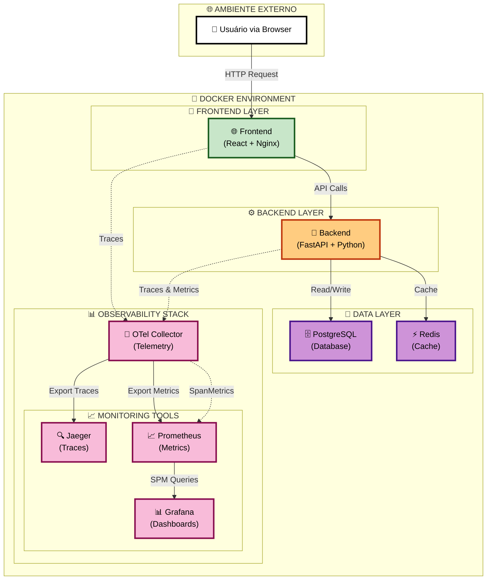

# 🧠 Fintelli - Finanças Inteligentes com IA

## 🎉 **Versão 1.0.0 - Stack Completo de Observabilidade Fintech**

Esta é uma aplicação full-stack para gerenciamento de finanças pessoais com inteligência artificial, totalmente containerizada com Docker e instrumentada com **OpenTelemetry** para observabilidade completa. Inclui **Service Performance Monitoring (SPM)** avançado, alertas inteligentes e documentação técnica abrangente.

## 🏗️ Diagrama de Arquitetura



## 📋 Arquitetura

- **Frontend**: Nginx servindo um site estático (HTML, CSS, JS) instrumentado com OTel JS SDK
- **Backend**: API RESTful com FastAPI (Python), instrumentada com OTel Python SDK
- **Banco de Dados**: PostgreSQL
- **Cache**: Redis
- **Orquestração**: Docker Compose

### 🔍 Pilha de Observabilidade

- **OTel Collector**: Recebe telemetria do frontend e backend
- **Jaeger**: Armazena e visualiza traces distribuídos
- **Prometheus**: Coleta e armazena métricas
- **Grafana**: Cria dashboards para visualizar as métricas

## 📁 Estrutura de Diretórios

```
fintelli/
├── src/
│   ├── backend/
│   │   ├── app/
│   │   │   ├── instrumentation.py  # Configuração do OpenTelemetry
│   │   │   └── main.py
│   │   ├── Dockerfile
│   │   └── requirements.txt
│   └── frontend/
│       ├── index.html
│       ├── telemetry.js            # Instrumentação OTel do Frontend
│       ├── package.json
│       ├── vite.config.ts
│       ├── Dockerfile
│       ├── nginx.conf
│       └── src/
│           ├── App.tsx
│           ├── main.tsx
│           ├── components/
│           └── services/
├── charts/
│   └── fintelli/               # Helm Chart para Kubernetes
├── config/
│   ├── otel-collector-config.yml     # Configuração do Collector
│   ├── prometheus.yml                # Configuração do Prometheus
│   ├── spm-alerts.yml                # Regras de alerta SPM
│   ├── fintelli-enhanced-alerts.yml  # Alertas avançados
│   ├── alertmanager.yml              # Configuração Alertmanager
│   └── grafana-spm-dashboard.json    # Dashboard SPM
├── docs/
│   ├── EBOOK_TECNOLOGIAS_FINTELLI.md # E-book técnico completo
│   ├── SPM_USER_GUIDE.md             # Guia do usuário SPM
│   ├── TESTING_GUIDE.md              # Guia de testes
│   ├── SECURITY_RECOMMENDATIONS.md   # Recomendações de segurança
│   └── IMPLEMENTACAO_COMPLETA_RESUMO.md
├── scripts/
│   ├── generate_secrets.sh           # Geração de credenciais
│   ├── security_check.sh             # Verificação de segurança
│   └── validate_spm.sh               # Validação do stack SPM
├── tests/
│   ├── backend/                      # Testes Python/FastAPI
│   ├── frontend/                     # Testes React/TypeScript
│   └── integration/                  # Testes de integração
├── .env
├── .env.example
├── CHANGELOG.md
└── docker-compose.yml
```

## 🛠️ Pré-requisitos

- **Docker**
- **Docker Compose**

## 🚀 Como Configurar e Executar

### 1. Crie os arquivos e diretórios
Garanta que a estrutura de diretórios e todos os arquivos abaixo estejam criados.

### 2. Crie e configure o arquivo `.env`
Na raiz do projeto, crie o arquivo `.env` com suas credenciais ou use o script de geração automática:

```bash
# Gerar credenciais seguras automaticamente
./scripts/generate_secrets.sh

# OU criar manualmente
# Credenciais do Banco de Dados Postgres
POSTGRES_DB=finance_db
POSTGRES_USER=finance_user
POSTGRES_PASSWORD=your_strong_password

# Chave da API do Gemini (Google AI) - OBRIGATÓRIO
GEMINI_API_KEY="SUA_CHAVE_API_AQUI"
```

### 3. Construa e inicie os contêineres
No terminal, na raiz do projeto, execute:

```bash
docker-compose up --build
```

### 4. Acesse os Serviços

| Serviço                   | URL                    | Descrição                       |
| ------------------------- | ---------------------- | ------------------------------- |
| **Aplicação de Finanças** | http://localhost:8080  | Interface principal             |
| **Backend API**           | http://localhost:8001  | API FastAPI + Documentação      |
| **Jaeger (Traces)**       | http://localhost:16686 | Visualização de traces + SPM    |
| **Prometheus (Métricas)** | http://localhost:9090  | Coleta de métricas              |
| **Grafana (Dashboards)**  | http://localhost:3000  | Dashboards (login: admin/admin) |
| **Alertmanager**          | http://localhost:9093  | Gestão de alertas               |

## 📊 Como Usar a Observabilidade

### 1. Use a aplicação
Adicione e remova algumas transações para gerar dados.

### 2. Visualize Traces no Jaeger

1. Abra o **Jaeger**
2. No menu "Service", selecione `finance-backend` ou `finance-frontend`
3. Clique em "Find Traces"
4. Você verá as requisições, desde o clique no navegador até a consulta no banco de dados

### 3. Explore Métricas no Grafana

1. Abra o **Grafana** e faça login
2. Vá em "Connections" > "Data sources" e adicione o Prometheus (URL: `http://prometheus:9090`)
3. Vá em "Dashboards" > "New dashboard" para criar painéis com as métricas disponíveis
   - Exemplos: `http_server_duration_seconds`, `transactions_created_total`

## 🎯 Service Performance Monitoring (SPM)

O Fintelli possui **Service Performance Monitoring (SPM)** avançado habilitado no Jaeger 1.51, que deriva automaticamente métricas de performance dos traces distribuídos coletados pelo OpenTelemetry.

### 🚀 Benefícios do SPM

- **📊 Métricas Automáticas**: Rate, Errors, Duration (RED) geradas dos traces
- **🔍 Visibilidade Completa**: Performance por endpoint, método HTTP e status
- **⚡ Alertas Inteligentes**: 55+ regras de alerta categorizadas
- **🎨 Dashboards Ricos**: Visualizações automáticas no Grafana
- **🛡️ SLA Monitoring**: Monitoramento contínuo de disponibilidade e latência
- **🔧 Detecção de Anomalias**: Identificação proativa de degradação

### 📈 Métricas SPM Disponíveis

```promql
# Taxa de requisições por segundo
rate(calls_total{service_name="fintelli-backend"}[5m])

# Latência P95
histogram_quantile(0.95, rate(duration_bucket{service_name="fintelli-backend"}[5m]))

# Taxa de erro
rate(calls_total{status_code=~"5.."}[5m]) / rate(calls_total[5m])

# Disponibilidade do serviço
(1 - rate(calls_total{status_code=~"5.."}[5m]) / rate(calls_total[5m])) * 100
```

### 🎛️ Como Usar o SPM

1. **Acesse o Jaeger**: http://localhost:16686
2. **Vá para "Monitor"**: Seção Service Performance Monitoring
3. **Explore Métricas**: Visualize latência, throughput e erros por serviço
4. **Configure Alertas**: Use as regras em `config/spm-alerts.yml`
5. **Dashboard Grafana**: Importe `config/grafana-spm-dashboard.json`

### 📚 Documentação Completa

- **[Guia do Usuário SPM](docs/SPM_USER_GUIDE.md)** - Tutorial completo
- **[E-book Tecnologias](docs/EBOOK_TECNOLOGIAS_FINTELLI.md)** - Documentação técnica
- **[Resumo da Implementação](docs/IMPLEMENTACAO_SPM_RESUMO.md)** - Visão executiva

### 🔧 Validação do SPM

```bash
# Validar stack completo incluindo SPM
./scripts/validate_spm.sh

# Verificar coleta de métricas SPM
curl "http://localhost:9090/api/v1/query?query=calls_total"

# Gerar traces para teste
curl -X POST http://localhost:8001/transactions/ \
  -H "Content-Type: application/json" \
  -d '{"amount": 100.0, "description": "Test SPM"}'
```

## 🛠️ Tecnologias Utilizadas

### 🎯 **FRONTEND**
#### **Framework & Biblioteca Principal**
-  - Biblioteca para interfaces de usuário
-  - Superset do JavaScript com tipagem estática
-  - Build tool e bundler moderno

#### **UI & Estilização**
-  - Framework CSS utility-first
-  - Processador CSS
-  - Biblioteca de ícones

#### **Gráficos & HTTP**
-  - Biblioteca de gráficos
-  - Cliente HTTP para chamadas de API

### 🔧 **BACKEND**
#### **Framework & Runtime**
-  - Framework web moderno para Python
-  - Linguagem de programação principal
-  - Servidor ASGI de alta performance

#### **Banco de Dados & Cache**
-  - Banco de dados relacional
-  - Cache em memória e broker de mensagens

#### **Inteligência Artificial**
-  - API do Gemini para análise de documentos

### 📊 **OBSERVABILIDADE & MONITORAMENTO**
#### **OpenTelemetry Stack**
-  - Observabilidade unificada
-  - Distributed tracing + SPM
-  - Coleta de métricas
-  - Dashboards e visualizações
-  - Gestão de alertas

### 🐳 **CONTAINERIZAÇÃO & DEPLOY**
-  - Containerização de aplicações
-  - Orquestração de múltiplos containers
-  - Servidor web e proxy reverso

### ☸️ **KUBERNETES (OPCIONAL)**
-  - Orquestração de containers
-  - Gerenciador de pacotes Kubernetes

### 🔐 **SEGURANÇA & CONFIGURAÇÃO**
-  - Configuração segura
-  - Cross-Origin Resource Sharing

---

### 📊 **RESUMO POR CATEGORIA:**

| **Categoria**         | **Tecnologias Principais**                        |
| --------------------- | ------------------------------------------------- |
| **🎨 Frontend**        | React + TypeScript + Tailwind + Vite              |
| **⚙️ Backend**         | FastAPI + Python + PostgreSQL + Redis             |
| **🤖 IA**              | Google Gemini AI                                  |
| **📊 Observabilidade** | OpenTelemetry + Jaeger SPM + Prometheus + Grafana |
| **🚨 Alertas**         | Alertmanager + 55+ regras de alerta               |
| **🐳 Containerização** | Docker + Docker Compose + Nginx                   |
| **☸️ Deploy**          | Kubernetes + Helm (opcional)                      |
| **🔒 Segurança**       | Scripts de validação + Credenciais seguras        |

**Total: 35+ tecnologias** integradas em uma aplicação completa de fintech! 🚀

---

## 🧪 Testes e Validações

O Fintelli possui uma suíte completa de testes automatizados que garante a qualidade e confiabilidade do sistema.

### 🚀 Execução Rápida de Todos os Testes

```bash
# Executar TODOS os testes (frontend + backend + integração)
./run_all_tests.sh

# Execução rápida (para no primeiro erro)
./run_all_tests.sh --quick

# Apenas testes específicos
./run_all_tests.sh --skip-frontend    # Apenas backend e integração
./run_all_tests.sh --skip-backend     # Apenas frontend e integração
./run_all_tests.sh --skip-integration # Apenas unit tests
```

### 📋 Tipos de Testes Disponíveis

#### 🎨 **Testes de Frontend**
```bash
cd tests/frontend
npm install
npm test                # Todos os testes
npm run test:coverage   # Com relatório de coverage
npm run test:e2e        # Testes end-to-end (Cypress)
```

**Cobertura**: Componentes React, utilitários JavaScript, integração com APIs

#### ⚙️ **Testes de Backend**
```bash
cd tests/backend
pip install -r requirements.txt
pytest                  # Todos os testes
pytest --cov=app        # Com coverage
pytest test_api.py      # Testes específicos
```

**Cobertura**: APIs FastAPI, PostgreSQL, Redis, Prometheus, Jaeger, OpenTelemetry

#### 🔗 **Testes de Integração**
```bash
./tests/integration/run_tests.sh
```

**Cobertura**: Docker Compose, networking, endpoints, observabilidade, logs

### 📊 Validações por Componente

| Componente         | Comando                                                          | URL de Verificação         |
| ------------------ | ---------------------------------------------------------------- | -------------------------- |
| **Frontend**       | `curl http://localhost:8080`                                     | http://localhost:8080      |
| **Backend API**    | `curl http://localhost:8001/health`                              | http://localhost:8001/docs |
| **PostgreSQL**     | `docker exec -it fintelli_db psql -U finance_user -d finance_db` | -                          |
| **Redis**          | `docker exec -it fintelli_cache redis-cli`                       | -                          |
| **Prometheus**     | `curl http://localhost:9090/api/v1/query?query=up`               | http://localhost:9090      |
| **Jaeger**         | `curl http://localhost:16686/api/services`                       | http://localhost:16686     |
| **Grafana**        | `curl http://localhost:3000`                                     | http://localhost:3000      |
| **Alertmanager**   | `curl http://localhost:9093/api/v1/status`                       | http://localhost:9093      |
| **OTel Collector** | `curl http://localhost:8889/metrics`                             | -                          |

### 🛡️ Validação de Segurança

```bash
# Verificar configurações de segurança
./scripts/security_check.sh

# Validar credenciais e ambiente
./scripts/validate_spm.sh

# Gerar novas credenciais seguras
./scripts/generate_secrets.sh
```

### 📖 Documentação Completa

- **[CHANGELOG](CHANGELOG.md)** - Histórico completo da versão 1.0.0
- **[Guia de Testes](tests/README.md)** - Documentação detalhada de todos os testes
- **[E-book Completo](docs/EBOOK_TECNOLOGIAS_FINTELLI.md)** - Guia técnico abrangente
- **[Guia SPM](docs/SPM_USER_GUIDE.md)** - Service Performance Monitoring
- **[Guia de Validações](docs/TESTING_GUIDE.md)** - Procedimentos de validação
- **[Recomendações de Segurança](docs/SECURITY_RECOMMENDATIONS.md)** - Boas práticas
- **[Resumo da Implementação](docs/IMPLEMENTACAO_COMPLETA_RESUMO.md)** - Visão executiva

### 🎯 Qualidade Garantida

- ✅ **Unit Tests**: Jest (Frontend) + Pytest (Backend)
- ✅ **Integration Tests**: APIs, banco de dados, cache
- ✅ **End-to-End Tests**: Fluxo completo da aplicação
- ✅ **Performance Tests**: Latência e throughput
- ✅ **Observability Tests**: Métricas e traces
- ✅ **Docker Tests**: Containers e networking
- ✅ **Security Tests**: Validações de segurança básicas
- ✅ **SPM Tests**: Service Performance Monitoring
- ✅ **Alert Tests**: Validação de regras de alerta

## 📋 **Alertas e Monitoramento Avançado**

### 🚨 Sistema de Alertas

O Fintelli possui **55+ regras de alerta** categorizadas para monitoramento completo:

#### 📊 **Categorias de Alertas**
- **🏢 Negócio**: Volume de transações, taxas de conversão, SLA
- **🔒 Segurança**: Tentativas de acesso, anomalias, compliance
- **🛡️ Compliance**: Auditoria, retenção de dados, regulamentações
- **🖥️ Infraestrutura**: CPU, memória, disco, rede, containers

#### ⚙️ **Configuração de Alertas**

```bash
# Configurações de alerta
config/spm-alerts.yml              # Regras SPM específicas
config/fintelli-enhanced-alerts.yml # Regras avançadas de negócio
config/alertmanager.yml           # Configuração do Alertmanager

# Testar alertas
curl -X POST http://localhost:9093/api/v1/alerts
```

#### 📈 **Dashboards Inclusos**
- **Dashboard SPM**: Métricas de performance por serviço
- **Métricas de Sistema**: CPU, memória, rede
- **Métricas de Negócio**: Transações, conversões
- **Alertas Ativos**: Status e histórico de alertas

## 🔒 **Segurança e Boas Práticas**

### 🛡️ **Recursos de Segurança**

- **🔐 Geração Automática de Credenciais**: Script `generate_secrets.sh`
- **🔍 Auditoria de Segurança**: Script `security_check.sh`
- **📝 Recomendações Documentadas**: `docs/SECURITY_RECOMMENDATIONS.md`
- **🚨 Alertas de Segurança**: Monitoramento de tentativas de acesso
- **🔄 Rotação de Credenciais**: Procedimentos documentados

### 📋 **Checklist de Segurança**

```bash
# Executar auditoria completa
./scripts/security_check.sh

# Gerar credenciais seguras
./scripts/generate_secrets.sh

# Validar configurações
./scripts/validate_spm.sh
```

---

## 🎯 **Próximos Passos e Roadmap**

### 🚀 **V2.0 Planejado**
- **🤖 Machine Learning**: Detecção de anomalias com IA
- **📱 APM Mobile**: Instrumentação React Native
- **🔄 CI/CD Integration**: Observabilidade no pipeline
- **🏢 Multi-tenancy**: Arquitetura SaaS
- **📊 Advanced Analytics**: Análises preditivas

### 📈 **Melhorias Contínuas**
- **Performance**: Otimização de latência < 100ms P95
- **Escalabilidade**: Suporte a milhões de transações
- **Compliance**: Certificações PCI-DSS, SOX
- **Integração**: APIs de terceiros (bancos, fintechs)

---

